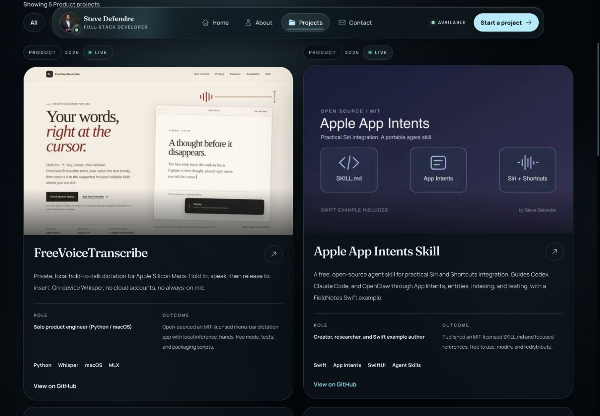
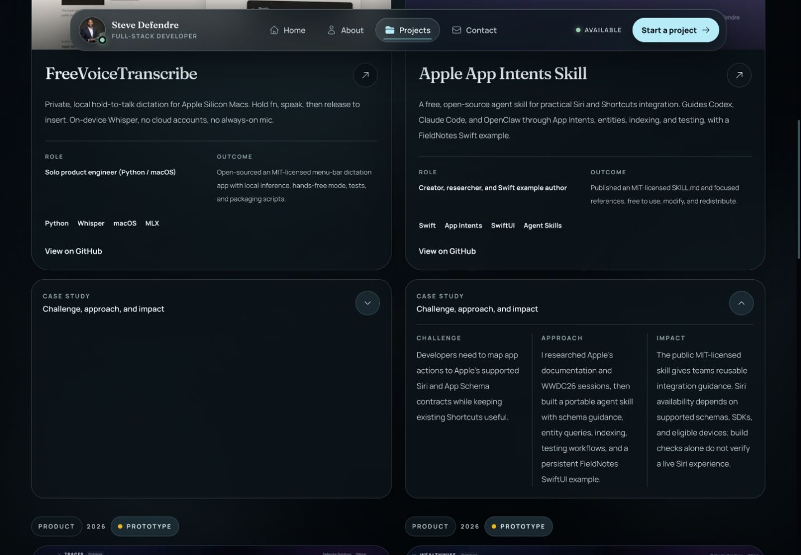
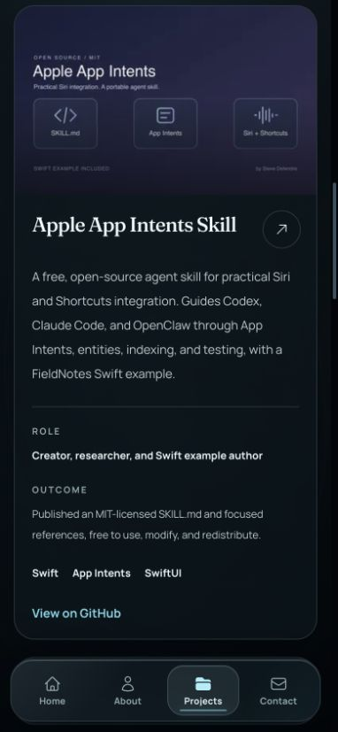
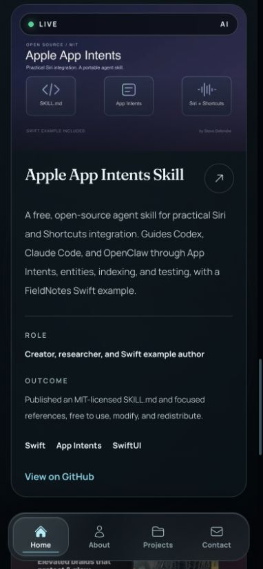

# Apple App Intents Skill portfolio card

Verified September 10, 2026 against the local production build.

The project appears in the homepage's selected work, the full project catalog, the Product filter, and the public WebMCP catalog. The entry preserves all existing projects and supplies the role, outcome, category, status, year, technology tags, GitHub CTA, image, and inline case study required by the existing contract. The homepage now reports 9 public builds and 7 active links.

Copy was checked against the public [source README](https://github.com/Sdefendre/apple-app-intents-skill/blob/52482a51247a59e1f108bdc4c8b36fecb954c0c8/README.md). GitHub metadata confirmed public visibility and MIT licensing. “Live” describes the available public project. The card makes no claim of universal Siri support or completed device testing.

## Validation

- `npm test`: 156 tests passed across 32 files.
- `npm run lint`: passed with one existing `no-head-element` warning in `scripts/render-static-home.tsx`.
- `npx tsc --noEmit`: passed.
- `npm run build`: passed, including static homepage regeneration and runtime checks.
- `npm run check:static-home`: passed.
- `npm run test:static-home`: 4 tests passed.
- `PLAYWRIGHT_TEST_BASE_URL=http://127.0.0.1:3117 npm run test:e2e -- --reporter=list`: 35 tests passed. Chromium covers the full suite; Firefox and WebKit cover accessibility contracts. Responsive layout and title checks cover 320, 390, 768, 1024, and 1440px.
- In-app browser: visually inspected the new card at 1440 × 1000 and 390 × 844; confirmed the image loads, GitHub destination is correct, and the inline case study expands. No horizontal overflow or browser console errors were observed on the checked catalog view.
- The initial test failures identified outdated project counts and selected-work expectations. These now include the added project. The catalog checks were also run before adding the entry and failed on its absence.

## Visual evidence









## Original artwork

`thumbnail.svg` is the original vector source, created for this card. Its JPEG export is `public/project-previews/apple-app-intents.jpg` (1600 × 1000). It uses original code, document, and waveform diagrams, with space above the title for the existing homepage status badge. It is an illustration of the skill's subject, not an app or device screenshot.

To regenerate from the repository root:

```sh
node --input-type=module -e 'import sharp from "sharp"; await sharp("docs/qa/apple-app-intents-20260910/thumbnail.svg").jpeg({quality:90, mozjpeg:true}).toFile("public/project-previews/apple-app-intents.jpg")'
```

The primary checkout was preserved. No merge or production deployment was performed.
