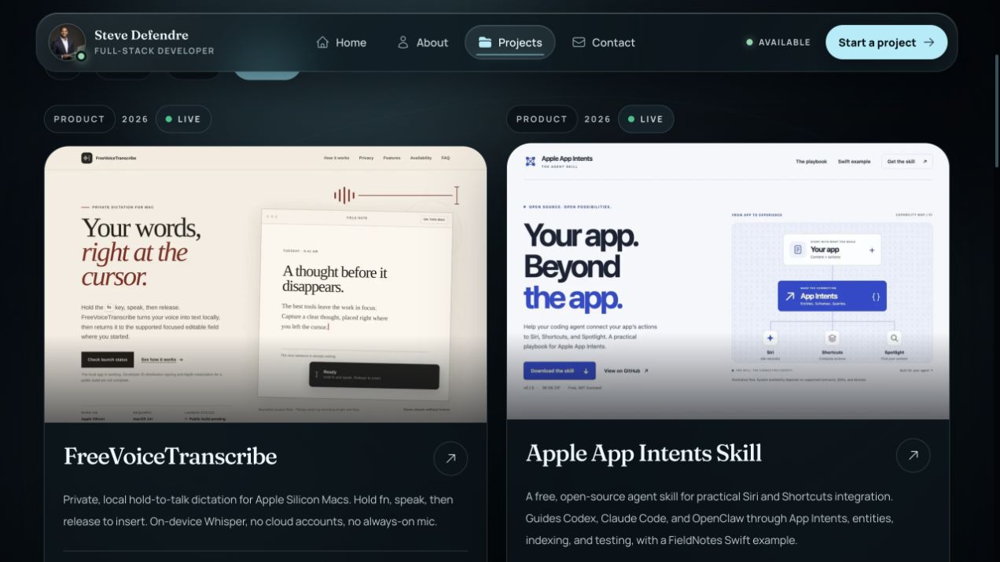
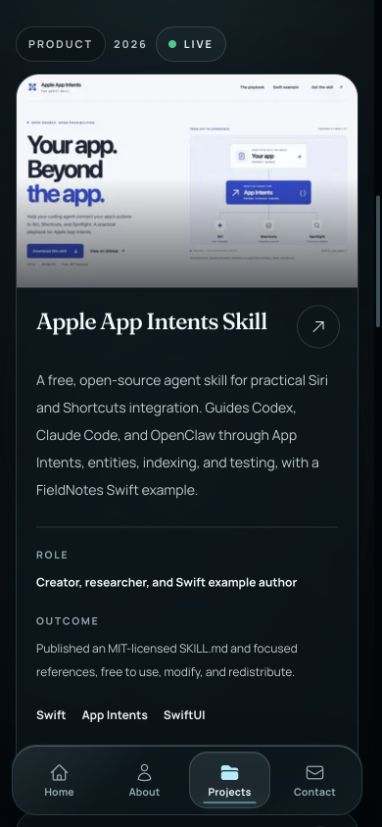

# Apple App Intents preview refresh — October 1, 2026

The Apple skill landing page was redesigned and deployed before this portfolio preview was captured.

- Source: https://sdefendre.github.io/apple-app-intents-skill/
- Source merge: `78e37db51833b4cd3093111af6fde4fc3eeb81c5` ([skill PR #2](https://github.com/Sdefendre/apple-app-intents-skill/pull/2)).
- GitHub Pages [deployment run](https://github.com/Sdefendre/apple-app-intents-skill/actions/runs/36894384826) succeeded for that exact commit; the public stylesheet SHA-256 matched the committed file.
- Preview: `public/project-previews/apple-app-intents-site-20261001.jpg`, captured from the live page with the Codex browser. The top 1280×800 pixels of the full-page capture fit the portfolio's 16:10 media frame. The dated filename avoids reusing the old image cache key.
- `src/data/projects.ts` references the new screenshot. The superseded preview was removed and the static homepage assets were regenerated.

Local validation passed: 188 Vitest tests, TypeScript, the production build, and all 12 static-home regeneration tests. ESLint passed with the existing static renderer `<head>` warning. The browser confirmed the image loads on the Product catalog and the static homepage references the new asset. The Apple project link still opens the live skill website. Desktop and phone catalog layouts were reviewed.

