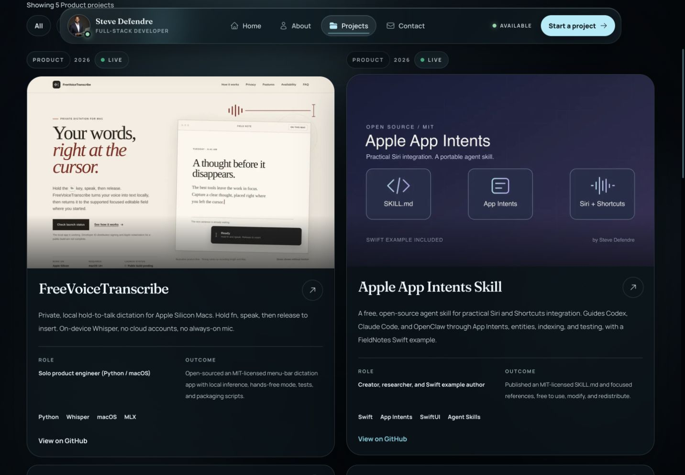
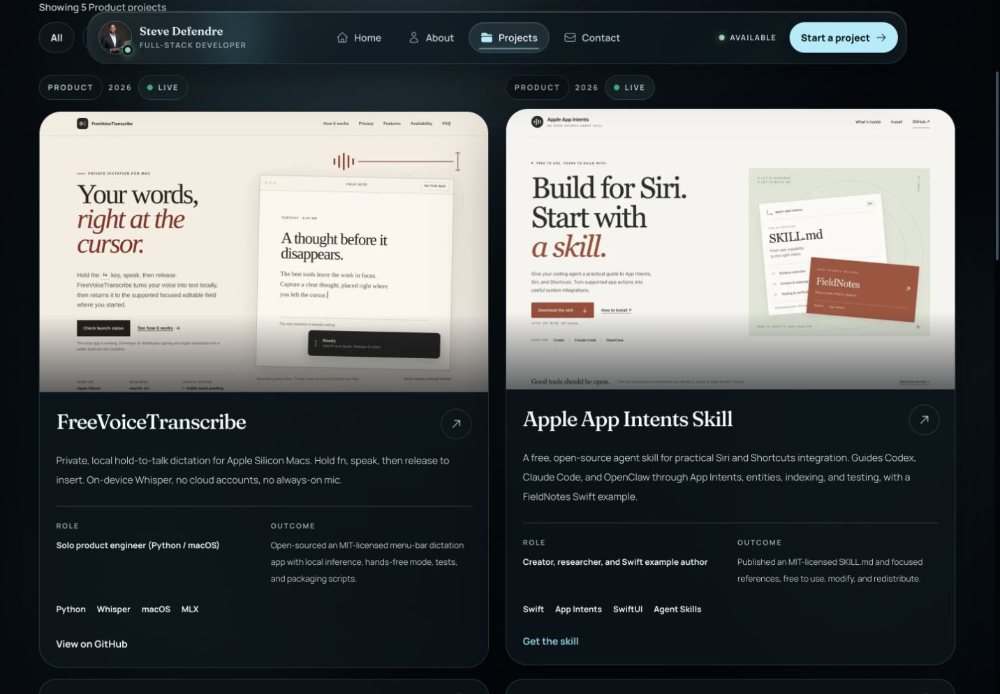
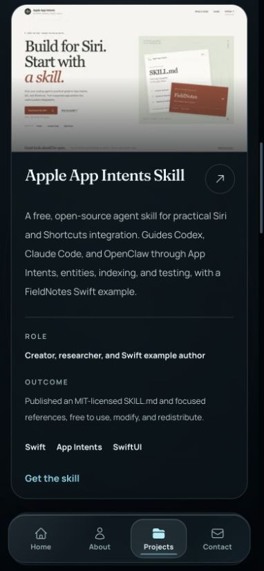
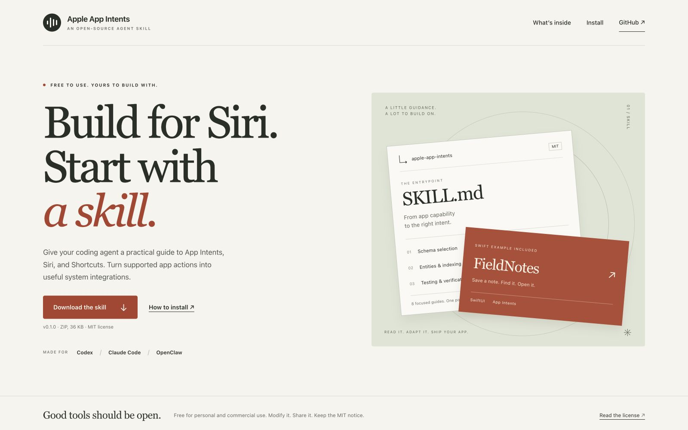

# Apple App Intents Skill website card

The card now opens https://sdefendre.github.io/apple-app-intents-skill/ with “Get the skill” as its CTA. It uses an actual screenshot of that public site's hero instead of the original diagram. The common project data updates the homepage, full catalog, and WebMCP destination together.

## Published destination

- Website PR: https://github.com/Sdefendre/apple-app-intents-skill/pull/1
- Published source commit: `e602bf61c75de2c178ca14f92fbaf63d365bb5bd`
- Successful Pages deployment: https://github.com/Sdefendre/apple-app-intents-skill/actions/runs/34441820627
- Public HTML SHA-256 matched the deployed source file: `01cdf35f97adfdd7eac413a75b38f235f432bc898a824bbbfdecceaff64caeb1`.
- Public HTML, CSS, JS, and favicon returned HTTP 200.
- Browser-tested the public download button: it triggered a download of the published v0.1.0 ZIP.
- Independently downloaded the archive and verified the published SHA-256: `f841a60848ed160f3eb4741fe82445ff7cf0b95a1df3539dfefa0a17e9f5349c`. The archive includes the complete skill folder, license, references, and Swift example.
- Public mobile installation navigation and copy-path feedback passed, with no observed console errors or horizontal overflow.

## Screenshot provenance

`live-site-hero.png` is an unedited browser capture of the public GitHub Pages URL at 1600 × 1000, September 10, 2026. Its JPEG encoding is `public/project-previews/apple-app-intents-site.jpg`; no visual content was synthesized or retouched. A new filename prevents the previous diagram from remaining cached at the image URL.

`before-desktop.png` is the production portfolio card from the prior PR #115 release. The after images show this PR's local production build at 1440 × 1000 and 390 × 844.

## Portfolio verification

- 156 unit tests passed across 32 files; 26 focused catalog/WebMCP checks passed again after finalizing the image filename.
- 35 browser regression tests passed: full Chromium suite and Firefox/WebKit accessibility checks, including responsive layouts from 320 to 1440px.
- Production build, explicit TypeScript check, static-home checks, and all four static-home tests passed.
- Lint passed with the existing `no-head-element` warning in `scripts/render-static-home.tsx`.
- Final manual desktop/mobile review confirmed the hero image loads, the CTA points to the published site, and the existing case study expands. No horizontal overflow.
- The primary checkout was preserved; this portfolio update is an unmerged PR.

| Before | After |
| --- | --- |
|  |  |

