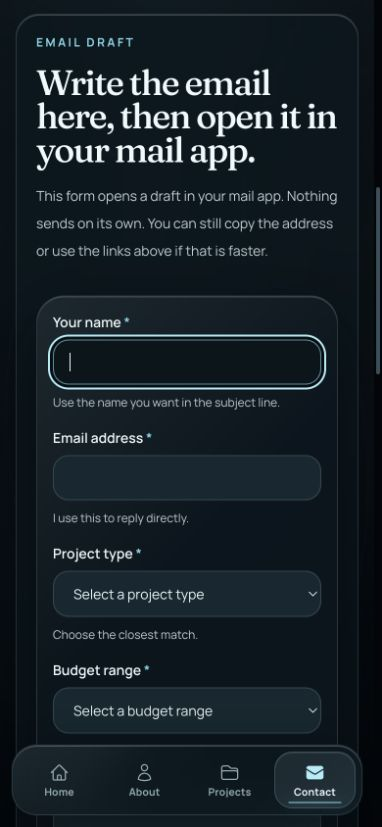
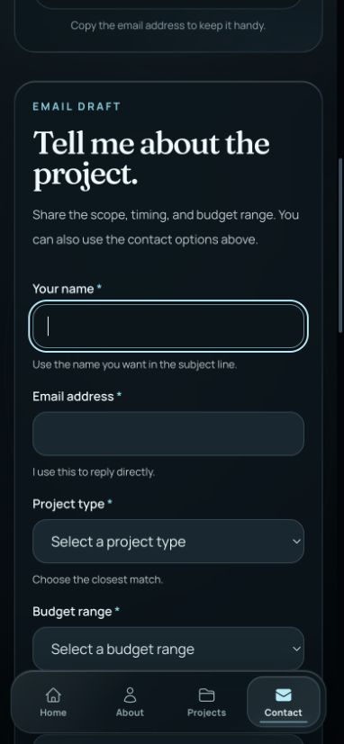

# Contact form visual fixes

Addresses visual audit findings 6 and 10. At 390 × 844, the input boxes grow from 274px to 308px after removing the inner mobile frame and padding. Field text is 16px. The heading is shorter, and one plain-language draft explanation replaces repeated protocol wording. Email preparation, validation, copying, and status behavior remain intact.

| Before | After |
| --- | --- |
|  |  |

Before: live production on September 5. After: local production build at 390 × 844, with the first field focused. Scroll position differs because the revised introduction is shorter.

Validation: 154 unit tests; 29 browser tests covering Chromium plus focused Firefox/WebKit accessibility; production build and TypeScript check; ESLint has no errors (one existing static-renderer warning). Visual inspection confirms the wider fields and readable focus state. Physical iOS device testing was not performed.
