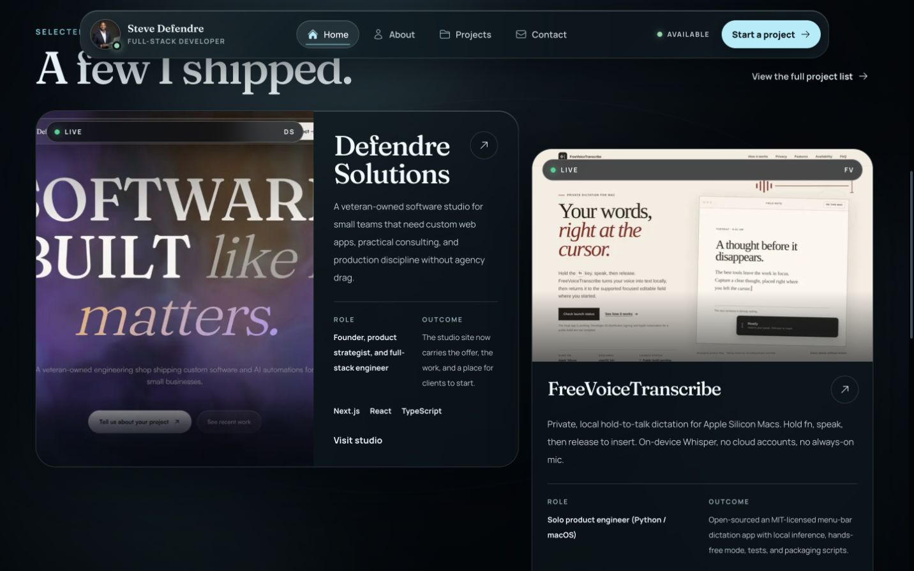
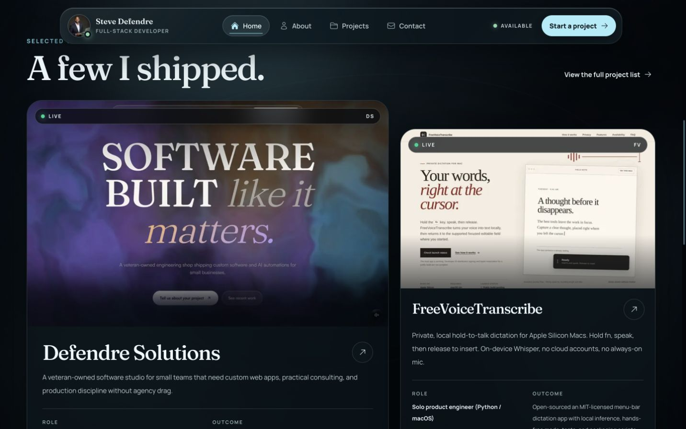
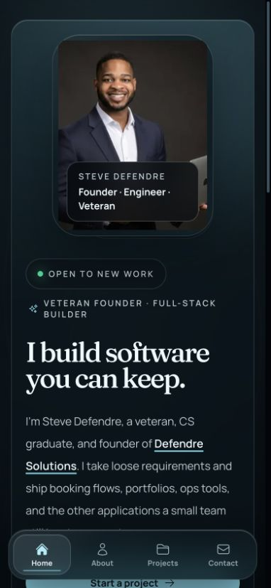
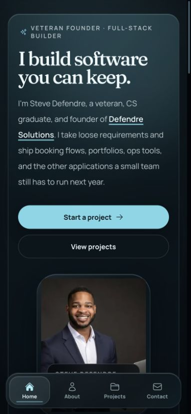
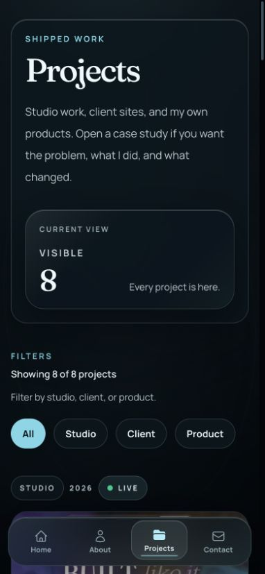
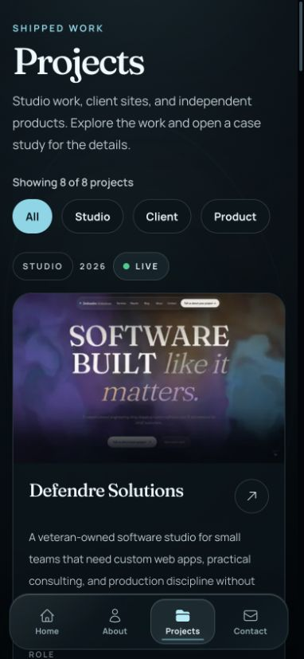

# Responsive layout and project-preview fixes

Addresses visual audit findings 1–5 and 7–9. Before images show production on September 5; after images show a local production build. Mobile comparisons use 390 × 844, and the featured preview uses 1440 × 900. Desktop scroll positions differ slightly to frame the selected-work section.

## Featured preview

The landscape screenshot now retains its 16:10 composition instead of filling a tall crop. The featured card stacks image and content at its available width.

| Before | After |
| --- | --- |
|  |  |

## Mobile homepage

The headline and actions precede the portrait. Selected projects continue vertically, so all four are discoverable through normal scrolling. Tablet navigation keeps visible destination labels.

| Before | After |
| --- | --- |
|  |  |

## Project explorer

A compact introduction, one count, and filters replace the oversized counter. Each project shows its status once. Summaries and outcomes are complete rather than clamped. Desktop card rows share sizing, aligning card bottoms and case-study controls while disclosures remain naturally sized.

| Before | After |
| --- | --- |
|  |  |

The additional WebKit check also caught a 320px minimum document width conflicting with the scrollbar's 8px gutter; removing that minimum lets the page fit the actual available width.

## Verification

- 154 unit tests; TypeScript and production build pass.
- 35 standard browser tests: Chromium plus existing Firefox/WebKit accessibility checks.
- 12 additional layout checks in Firefox and WebKit through a temporary local HTTPS test proxy. HTTPS is needed because the static homepage's existing security policy upgrades requests. No production security policy changes are included.
- New layout coverage at 320, 390, 768, 1024, and 1440px checks preview ratio, vertical mobile continuation, unclamped summaries, unique statuses, card alignment, mobile action visibility, About reading order, and tablet labels.
- Static homepage source and generated HTML/CSS hashes verified.
- ESLint has no errors; the pre-existing static renderer head-element warning remains.

Physical-device iOS testing was not performed. This PR is independent of the contact-form PR.
